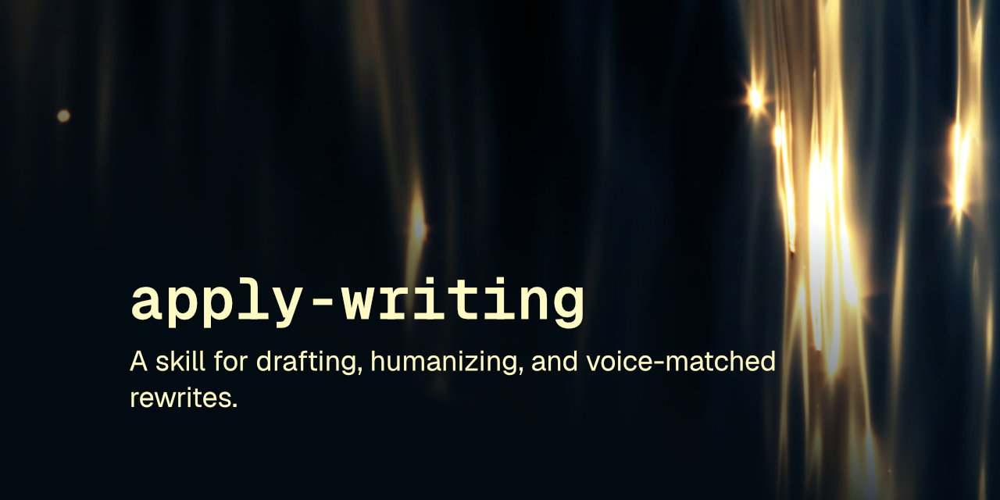

# prose

Writing skill drafts & humanizes text. Kills AI patterns, matches your voice.

 

A drafting and review skill for prose: writes new content in the correct voice and structure for the medium, or scans existing text for AI writing patterns and rewrites it in an authentic human voice.

This skill follows the [Agent Skills specification](https://agentskills.io/specification) so it can be used by any skills-compatible agent.

## Installation

### npx skills
    npx skills add robcsaszar/prose

### Marketplace
    /plugin marketplace add robcsaszar/prose
    /plugin install robcsaszar-prose@prose

### Manually
Copy the `skills/prose/` directory into your project's `.claude/skills/`.

## What it does

The skill runs in two modes, detected from context. Draft mode takes a topic, brief, or outline and produces new content, first asking what the reader needs to do or feel, what would surprise them, and what concrete example can carry the piece, then drafting and running required checks. Review mode takes existing text, auto-detects its channel (blog, social media, email, or IM), scans it against a library of universal and channel-specific AI writing markers, scores it, and produces a rewrite that keeps every original idea while replacing flagged phrasing, varying sentence rhythm, and restoring a human voice.

It supports voice calibration from a writing sample so drafts and rewrites can match a specific person's sentence rhythm, word choice, and structural habits, and it updates its own pattern library with novel AI-writing markers found during review.

## License
[MIT](LICENSE) © Rob Csaszar
